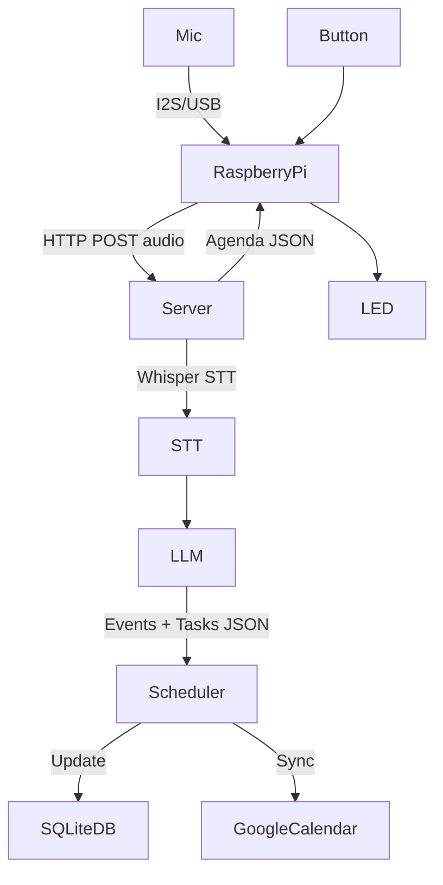

# 📘 SmartPager

A distraction-free AI planner that combines the calm of paper with the intelligence of the cloud.

Users speak natural language, and SmartPager transforms the speech into structured events, tasks, and study blocks, schedules them optimally, and syncs everything into Google Calendar.

The pager device shows your **Next Event/Task** and **Today's Agenda** on a crisp e-ink display and buzzes when something important is due.

---

## 📑 Table of Contents

-   [Quick Start - Audio Capture](#-quick-start---audio-capture) 🎤
-   [Project Overview](#-project-overview)
-   [Quick Architecture Summary (5-Minute Read)](#️-quick-architecture-summary-5-minute-read) ⭐
-   [Hardware Components](#-hardware-components)
-   [Raspberry Pi Pinout](#-raspberry-pi-pinout)
-   [System Architecture](#-system-architecture)
-   [Scheduling Architecture (Core Concepts)](#-scheduling-architecture-core-concepts) ⭐
-   [Syncing and Reconciliation Loop](#-syncing-and-reconciliation-loop) ⭐
-   [Data Ownership and Responsibilities](#-data-ownership-and-responsibilities)
-   [Weekly Optimization Behavior](#-weekly-optimization-behavior)
-   [Directory Structure](#-directory-structure)
-   [Backend Flow (Detailed View)](#-backend-flow-detailed-view)
-   [Database Schema (SQLite)](#-database-schema-sqlite)
-   [Example Agenda JSON](#-example-agenda-json-server--raspberry-pi)
-   [Server API Reference](#-server-api-reference)
-   [Server Tasks (FastAPI)](#-server-tasks-fastapi)
-   [Authentication](#-authentication)
-   [UI Behavior](#-ui-behavior)
-   [Build Instructions](#️-build-instructions)
-   [Future Enhancements](#-future-enhancements)

> ⭐ = Essential reading for understanding the scheduling architecture  
> 🎤 = Start here for audio capture development

---

## 🎤 Quick Start - Audio Capture

Get started quickly with the audio capture feature (currently implemented).

### Hardware Setup - Raspberry Pi 4B (10 minutes)

#### Option A: I2S Microphone (SPH0645)

1. **Enable I2S on Raspberry Pi:**

```bash
# Edit config.txt
sudo nano /boot/config.txt

# Add this line at the end:
dtoverlay=googlevoicehat-soundcard

# Or for generic I2S mic:
dtoverlay=i2s-mmap
dtoverlay=sph0645lm4h-overlay

# Reboot
sudo reboot
```

2. **Connect SPH0645 Microphone to Raspberry Pi:**

| SPH0645 Pin | Raspberry Pi Pin | BCM GPIO | Description                 |
| ----------- | ---------------- | -------- | --------------------------- |
| 3V          | Pin 1 (3.3V)     | -        | Power supply (3.3V)         |
| GND         | Pin 6 (GND)      | -        | Ground                      |
| BCLK        | Pin 12           | GPIO 18  | Bit clock (PCM CLK)         |
| DOUT        | Pin 38           | GPIO 20  | Data out (PCM DIN)          |
| LRCL        | Pin 35           | GPIO 19  | Left/Right clock (PCM FS)   |
| SEL         | GND              | -        | Channel select (GND = Left) |

```
Raspberry Pi 4B GPIO Header (I2S Microphone)
============================================

                    3.3V [1]  [2] 5V
                         [3]  [4] 5V
                         [5]  [6] GND ◄── SPH0645 GND
                         [7]  [8]
                     GND [9]  [10]
                        [11]  [12] GPIO18 ◄── SPH0645 BCLK
                        [13]  [14] GND
                        [15]  [16]
              3.3V ◄── [17]  [18]
                        [19]  [20] GND
                        [21]  [22]
        Button ◄── GPIO11 [23]  [24]
                     GND [25]  [26]
                        [27]  [28]
                        [29]  [30] GND
                        [31]  [32]
          LED ◄── GPIO26 [33]  [34] GND
    SPH0645 LRCL ◄── GPIO19 [35]  [36]
                        [37]  [38] GPIO20 ◄── SPH0645 DOUT
                     GND [39]  [40]

SPH0645 Pin Connections:
  • 3V   → Pin 1 (3.3V)
  • GND  → Pin 6 (or any GND)
  • BCLK → Pin 12 (GPIO 18)
  • DOUT → Pin 38 (GPIO 20)
  • LRCL → Pin 35 (GPIO 19)
  • SEL  → GND (for Left channel)
```

#### Option B: USB Microphone (Easier Setup)

Simply plug in a USB microphone - the script auto-detects it!

3. **Connect Button (Push-to-Talk):**

| Component | Raspberry Pi Pin | BCM GPIO | Description               |
| --------- | ---------------- | -------- | ------------------------- |
| Button    | Pin 23           | GPIO 11  | Push-to-talk (active-LOW) |
| Button    | Pin 25 (GND)     | -        | Ground                    |

```
Button Wiring:
    Raspberry Pi              Button              Ground
    ┌────────────┐           ┌──────┐           ┌──────┐
    │            │           │      │           │      │
    │ Pin 23     ├───────────┤  1   │           │ GND  │
    │ (GPIO 11)  │           │      │           │      │
    │            │           │   2  ├───────────┤Pin 25│
    │            │           │      │           │      │
    └────────────┘           └──────┘           └──────┘

  • Uses internal pull-up resistor
  • Button pressed = GPIO reads LOW
  • Button released = GPIO reads HIGH
```

4. **Connect Status LED (optional):**

| Component | Raspberry Pi Pin | BCM GPIO | Description       |
| --------- | ---------------- | -------- | ----------------- |
| LED (+)   | Pin 37           | GPIO 26  | Via 220Ω resistor |
| LED (-)   | Pin 39 (GND)     | -        | Ground            |

```
LED Wiring:
    Raspberry Pi       Resistor (220Ω)      LED           Ground
    ┌────────────┐    ┌────────┐        ┌──────┐       ┌──────┐
    │            │    │        │        │ Anode│       │      │
    │ Pin 37     ├────┤  220Ω  ├────────┤  +   │       │ GND  │
    │ (GPIO 26)  │    │        │        │      │       │      │
    │            │    │        │        │Cathode       │      │
    │            │    │        │        │  -   ├───────┤Pin 39│
    └────────────┘    └────────┘        └──────┘       └──────┘
```

### Server Setup (3 minutes)

```bash
cd smartPager/server

# Create virtual environment
python3 -m venv venv

# Activate venv
source venv/bin/activate  # macOS/Linux
# or: venv\Scripts\activate  # Windows

# Install dependencies
pip install -r requirements.txt

# Create .env file for API keys
echo "OPENAI_API_KEY=your_openai_api_key_here" > .env

# Run server
python audioCapture_server.py
```

Server runs at `http://localhost:5000`

### Raspberry Pi Client Setup (5 minutes)

```bash
# On your Raspberry Pi
cd smartPager/pi

# Install system dependencies
sudo apt-get update
sudo apt-get install -y python3-pip python3-venv portaudio19-dev

# Create virtual environment
python3 -m venv venv
source venv/bin/activate

# Install Python dependencies
pip install -r requirements.txt

# Edit the server URL in the script
nano audio_capture_rpi.py
# Change SERVER_URL to your server's IP address:
# SERVER_URL = "http://YOUR_SERVER_IP:5000/upload"

# Run the audio capture client
python3 audio_capture_rpi.py
```

### View Recordings

Open browser: `http://localhost:5000` to see all recordings with playback and download.

### Status Indicators

**LED Indicators (GPIO 26):**

-   **Solid ON** = Recording in progress
-   **Fast blinking** = Processing/uploading audio
-   **3 pulses** = Recording saved & uploaded successfully
-   **OFF** = Idle, ready to record

---

## 🚀 Project Overview

SmartPager consists of:

### 1. Hardware Device (Raspberry Pi 4B)

-   Captures voice via I2S MEMS microphone or USB microphone
-   Sends audio to the server for processing
-   Push-to-talk button interface
-   LED status indicator
-   Lightweight Python client

### 2. Cloud backend (Server, Python Flask/FastAPI)

-   Converts audio → transcript (Whisper API)
-   Interpret transcript via LLM (GPT-4.x) → structured events & tasks
-   Applies scheduling (rule-based or LLM-optimized)
-   Syncs with Google Calendar via OAuth2
-   Stores a local DB mirror (SQLite)
-   Serves agendas to the Raspberry Pi client

---

## ⚡️ Quick Architecture Summary (5-Minute Read)

> **TL;DR for New Engineers:** Understanding how SmartPager schedules your time.

### Three Types of Data

1. **Hard Events** = Fixed calendar items (class, meetings, recurring events)

    - Stored: Google Calendar + SQLite mirror
    - SmartPager **never moves these**

2. **Tasks** = Work items (homework, reading, projects)

    - Stored: SQLite **only** (not in Google Calendar)
    - Have due dates, estimated durations, priorities

3. **Study Blocks** = Scheduled time to complete tasks
    - Stored: Google Calendar + SQLite
    - Created by SmartPager, **can be moved/deleted**
    - Titled like "Study: HW3"

### Two Sources of Truth (Bidirectional Sync)

```
┌─────────────────────┐         ┌─────────────────────┐
│  Google Calendar    │ ←─sync─→│  SQLite Database    │
│                     │         │                     │
│  • Hard Events      │         │  • Hard Events      │
│  • Study Blocks     │         │  • Tasks            │
│                     │         │  • Study Blocks     │
│  (User-facing)      │         │  (Internal)         │
└─────────────────────┘         └─────────────────────┘
```

**Google Calendar** = What the user sees (hard events + study blocks)  
**SQLite Database** = What the scheduler uses (+ tasks with metadata)

### How It Works (5 Steps)

1. **Pull** → SmartPager syncs down events from Google Calendar
2. **Parse** → User speaks → Whisper STT → LLM extracts events/tasks
3. **Update DB** → Insert new tasks and hard events into SQLite
4. **Optimize** → Scheduler allocates study blocks for tasks
5. **Push** → SmartPager syncs study blocks up to Google Calendar

### Key Rules

-   Hard events **always win** in conflicts
-   Tasks stay in the database; study blocks represent them in Google Calendar
-   Users can move/delete study blocks in Google Calendar; SmartPager respects this
-   Scheduler re-optimizes when:
    -   New tasks added
    -   Hard events change
    -   User manually edits study blocks

### Example

```
User says: "I have a Signals class Tue/Thu at 7 PM and need to finish HW 3 by Friday"

SmartPager:
1. Creates hard event: "Signals Class" (Tue/Thu 7 PM, recurring)
   → Syncs to Google Calendar
2. Creates task: "Finish HW 3" (due Friday, 3 hours)
   → Stays in database only
3. Scheduler finds free time, creates study blocks:
   → "Study: HW3" Mon 2-4 PM (2 hrs)
   → "Study: HW3" Wed 3-4 PM (1 hr)
   → Syncs to Google Calendar

Result:
- Google Calendar shows: Signals class (Tue/Thu) + Study blocks (Mon/Wed)
- Client receives merged agenda
- Database tracks: Task → Study Blocks → Google Event IDs
```

---

## 🧱 Hardware Components

| Component                    | Function                 | Compatibility       |
| ---------------------------- | ------------------------ | ------------------- |
| Raspberry Pi 4B              | Main compute, WiFi, GPIO | 5V/3.3V logic       |
| Adafruit SPH0645 I²S Mic     | Voice capture (I2S)      | I²S, 3.3V           |
| USB Microphone (alternative) | Voice capture (USB)      | USB Audio           |
| Push Button                  | Push-to-talk recording   | GPIO digital input  |
| Status LED                   | Visual feedback          | GPIO digital output |

---

## 🔌 Raspberry Pi Pinout

### I²S Audio (SPH0645 Microphone)

| Function                | Device  | RPi Pin | BCM GPIO |
| ----------------------- | ------- | ------- | -------- |
| I²S BCLK (Bit Clock)    | SPH0645 | Pin 12  | GPIO 18  |
| I²S LRCLK (Word Select) | SPH0645 | Pin 35  | GPIO 19  |
| I²S DOUT (Data)         | SPH0645 | Pin 38  | GPIO 20  |
| Power (3.3V)            | SPH0645 | Pin 1   | -        |
| Ground                  | SPH0645 | Pin 6   | -        |

#### 🎤 Adafruit SPH0645 I²S Microphone Wiring

Connect the SPH0645 to your Raspberry Pi 4B as follows:

| SPH0645 Pin | Raspberry Pi Pin | BCM GPIO | Description                 |
| ----------- | ---------------- | -------- | --------------------------- |
| 3V          | Pin 1 (3.3V)     | -        | Power supply (3.3V)         |
| GND         | Pin 6 (GND)      | -        | Ground                      |
| BCLK        | Pin 12           | GPIO 18  | Bit clock (PCM CLK)         |
| DOUT        | Pin 38           | GPIO 20  | Data out (PCM DIN)          |
| LRCL        | Pin 35           | GPIO 19  | Left/Right clock (PCM FS)   |
| SEL         | GND              | -        | Channel select (GND = Left) |

**I2S Configuration:**

Before using the I2S microphone, you need to enable I2S on the Raspberry Pi:

```bash
# Edit boot config
sudo nano /boot/config.txt

# Add these lines:
dtparam=i2s=on
dtoverlay=i2s-mmap

# For SPH0645 specifically, you may need:
dtoverlay=googlevoicehat-soundcard
# OR create a custom overlay

# Reboot to apply changes
sudo reboot
```

**Verify I2S is working:**

```bash
# Check if I2S device appears
arecord -l

# Test recording
arecord -D plughw:1,0 -f S16_LE -r 16000 -c 1 -d 5 test.wav
aplay test.wav
```

**Notes:**

-   SEL pin determines Left/Right channel. Ground for Left channel (default).
-   The SPH0645 outputs 18-bit data but we capture as 16-bit samples.
-   Microphone hole should face outward for best audio capture.

### Buttons + LED

| Function            | Raspberry Pi Pin | BCM GPIO |
| ------------------- | ---------------- | -------- |
| Push-to-Talk Button | Pin 23           | GPIO 11  |
| Status LED          | Pin 37           | GPIO 26  |

#### 🔘 Button Wiring Instructions

**Push-to-Talk Button (GPIO 11):**

The button uses the Raspberry Pi's internal pull-up resistor:

```
    Raspberry Pi             Button              Ground
    ┌────────────┐          ┌──────┐           ┌──────┐
    │            │          │      │           │      │
    │ Pin 23     ├──────────┤  1   │           │ GND  │
    │ (GPIO 11)  │          │      │           │      │
    │            │          │   2  ├───────────┤Pin 25│
    │            │          │      │           │      │
    └────────────┘          └──────┘           └──────┘
```

**Wiring Steps:**

1. Connect one pin of the button to **Pin 23 (GPIO 11)**
2. Connect the other pin of the button to **Pin 25 (GND)**
3. That's it! The code enables the internal pull-up resistor.

**How it works:**

-   Button not pressed: GPIO 11 reads HIGH (pulled up internally)
-   Button pressed: GPIO 11 reads LOW (connected to ground)
-   The code uses `GPIO.PUD_UP` and checks for `GPIO.input(BUTTON_GPIO) == GPIO.LOW`

**Status LED (GPIO 26):**

```
    Raspberry Pi       Resistor (220Ω)      LED           Ground
    ┌────────────┐    ┌────────┐        ┌──────┐       ┌──────┐
    │            │    │        │        │ Anode│       │      │
    │ Pin 37     ├────┤  220Ω  ├────────┤  +   │       │ GND  │
    │ (GPIO 26)  │    │        │        │      │       │      │
    │            │    │        │        │Cathode       │      │
    │            │    │        │        │  -   ├───────┤Pin 39│
    └────────────┘    └────────┘        └──────┘       └──────┘
```

**Wiring Steps:**

1. Connect **Pin 37 (GPIO 26)** to one end of a **220Ω resistor**
2. Connect the other end of the resistor to the **anode (+, longer leg)** of the LED
3. Connect the **cathode (-, shorter leg)** of the LED to **Pin 39 (GND)**

**LED Indicators:**

-   **Solid ON**: Recording in progress
-   **Fast blinking**: Processing/uploading audio
-   **3 pulses**: Recording uploaded successfully
-   **OFF**: Idle, ready to record

### Complete Raspberry Pi 4B Pinout Diagram

```
                    Raspberry Pi 4B GPIO Header
    ┌─────────────────────────────────────────────────────────┐
    │                                                         │
    │  3.3V [1]  [2] 5V                                      │
    │       [3]  [4] 5V                                      │
    │       [5]  [6] GND ◄── SPH0645 GND / LED GND           │
    │       [7]  [8]                                         │
    │   GND [9]  [10]                                        │
    │      [11]  [12] GPIO18 ◄── SPH0645 BCLK                │
    │      [13]  [14] GND                                    │
    │      [15]  [16]                                        │
    │ 3.3V [17]  [18]                                        │
    │      [19]  [20] GND                                    │
    │      [21]  [22]                                        │
    │ GPIO11 [23]  [24]         ◄── Button                   │
    │   GND [25]  [26]          ◄── Button GND               │
    │      [27]  [28]                                        │
    │      [29]  [30] GND                                    │
    │      [31]  [32]                                        │
    │      [33]  [34] GND                                    │
    │ GPIO19 [35]  [36]         ◄── SPH0645 LRCL             │
    │ GPIO26 [37]  [38] GPIO20  ◄── LED / SPH0645 DOUT       │
    │   GND [39]  [40]          ◄── LED GND                  │
    │                                                         │
    └─────────────────────────────────────────────────────────┘

    Summary:
    ┌──────────────┬──────────┬──────────┬──────────────────┐
    │ Component    │ BCM GPIO │ Pin #    │ Notes            │
    ├──────────────┼──────────┼──────────┼──────────────────┤
    │ Button       │ GPIO 11  │ Pin 23   │ Active LOW       │
    │ LED          │ GPIO 26  │ Pin 37   │ Via 220Ω resistor│
    │ SPH0645 BCLK │ GPIO 18  │ Pin 12   │ I2S Bit Clock    │
    │ SPH0645 LRCL │ GPIO 19  │ Pin 35   │ I2S Word Select  │
    │ SPH0645 DOUT │ GPIO 20  │ Pin 38   │ I2S Data         │
    └──────────────┴──────────┴──────────┴──────────────────┘
```

---

## 🧠 System Architecture



### Data Flow Architecture (Dual-Source-of-Truth)

```
┌─────────────────────────────────────────────────────────────────┐
│                      Google Calendar                            │
│  (Public User-Facing Source of Truth)                           │
│                                                                   │
│  • Hard Events (fixed: class, meetings, recurring)              │
│  • Study Blocks (flexible: "Study: HW3", created by SmartPager) │
└─────────────────────┬───────────────────────────────────────────┘
                      │
                      │ Pull (sync down)
                      ↓
         ┌────────────────────────────┐
         │    SmartPager Server        │
         │                             │
         │  ┌──────────────────────┐  │
         │  │   SQLite Database    │  │
         │  │ (Internal SoT)       │  │
         │  │                      │  │
         │  │ • Hard Events (mirror)│ │
         │  │ • Tasks (not in GC)  │  │
         │  │ • Study Blocks meta  │  │
         │  │ • Task→Block mapping │  │
         │  └──────────────────────┘  │
         │            │                │
         │            ↓                │
         │  ┌──────────────────────┐  │
         │  │  Scheduler/Optimizer │  │
         │  │  (Rule or LLM-based) │  │
         │  └──────────────────────┘  │
         └────────────┬───────────────┘
                      │
                      │ Push (sync up: study blocks only)
                      ↓
         ┌────────────────────────────┐
         │   Google Calendar (again)  │
         │   Updated with new study   │
         │   blocks                   │
         └────────────────────────────┘
                      │
                      │ GET /agenda/next
                      ↓
         ┌────────────────────────────┐
         │      Raspberry Pi Client   │
         │  (Receives merged schedule)│
         └────────────────────────────┘
```

### Complete End-to-End Flow (User Input → Display)

```
                    ┌─────────────────┐
                    │  User speaks:   │
                    │  "I have class  │
                    │   Tue at 7 PM"  │
                    └────────┬────────┘
                             │
                             ↓
              ┌──────────────────────────┐
              │  Raspberry Pi records    │
              │  POST /upload            │
              └──────────┬───────────────┘
                         │
                         ↓
              ┌──────────────────────────┐
              │  Server: Whisper STT     │
              │  "I have class Tue..."   │
              └──────────┬───────────────┘
                         │
                         ↓
              ┌──────────────────────────┐
              │  LLM parses transcript   │
              │  → events[] + tasks[]    │
              └──────────┬───────────────┘
                         │
                         ↓
      ┌──────────────────┴──────────────────┐
      │                                      │
      ↓                                      ↓
┌─────────────┐                    ┌─────────────────┐
│ Hard Event: │                    │ Task:           │
│ "Class"     │                    │ "Finish HW"     │
│ Tue 7 PM    │                    │ Due: Friday     │
└─────┬───────┘                    └────────┬────────┘
      │                                     │
      │ Sync to Google Calendar             │ Stays in DB
      ↓                                     │
┌─────────────┐                            │
│  Google Cal │                            │
│  Event      │                            ↓
│  Created    │                  ┌──────────────────┐
└─────────────┘                  │  Scheduler runs  │
                                 │  Finds free slots│
                                 └────────┬─────────┘
                                          │
                                          ↓
                              ┌───────────────────────┐
                              │ Study Blocks created: │
                              │ "Study: HW" Mon 2 PM  │
                              └───────┬───────────────┘
                                      │
                                      │ Sync to Google Calendar
                                      ↓
                              ┌───────────────────────┐
                              │  Google Calendar      │
                              │  Events created       │
                              └───────┬───────────────┘
                                      │
                                      │ Merge: Hard Events + Study Blocks
                                      ↓
                              ┌───────────────────────┐
                              │  GET /api/agenda/next │
                              │  GET /api/agenda/today│
                              └───────┬───────────────┘
                                      │
                                      ↓
                              ┌───────────────────────┐
                              │  Client displays      │
                              │  schedule info        │
                              │                       │
                              │  NEXT: Class (7 PM)   │
                              │  TODAY: Study: HW (2) │
                              └───────────────────────┘
```

---

## 📚 Scheduling Architecture (Core Concepts)

### 1. Hard Events vs Soft Commitments

**Hard Events:**

-   Come directly from Google Calendar
-   Fixed, non-movable time blocks (e.g., class, meetings, recurring events)
-   SmartPager **does not override** these unless explicitly instructed by the user
-   Always take precedence in scheduling conflicts
-   Stored in the `events` table with `source = "google"` or `source = "smartpager"`

**Study Blocks (Soft Commitments):**

-   Flexible, scheduled time blocks created by SmartPager to complete tasks
-   **Can be moved** when the scheduler re-optimizes
-   Appear in Google Calendar as normal events (e.g., "Study: HW3")
-   Stored in `events` table with `source = "study_block"` and also tracked in `study_blocks` table

### 2. Tasks

**Tasks** exist **only in SmartPager's database** and represent work items:

-   Homework assignments
-   Deliverables
-   Reading tasks
-   Personal projects

**Key Characteristics:**

-   Have due dates, workload estimates (duration), and priorities
-   **Do NOT appear directly in Google Calendar**
-   Remain in the `tasks` table until completed
-   The scheduler allocates study blocks to complete them

**Example:**

```
Task: "Finish HW 3"
Due: Friday 11:59 PM
Estimated Duration: 3 hours
Priority: High
Status: pending
```

### 3. Study Blocks

**Study Blocks** are SmartPager's way of allocating time to complete tasks:

-   Scheduled time slots in Google Calendar
-   Each corresponds to a calendar event with a `google_event_id`
-   Titled like: `"Study: HW3"`, `"Work on Final Project"`, `"Read Chapter 5"`
-   Stored in both:
    -   `events` table (as calendar events)
    -   `study_blocks` table (with `task_id` linkage)

**Lifecycle:**

-   **Created** by the scheduler when tasks need time allocated
-   **Moved** when re-optimization finds better time slots
-   **Deleted** from Google Calendar if no longer needed (e.g., task completed)
-   **Reconciled** if user manually edits/deletes them in Google Calendar

### 4. Dual-Source-of-Truth Architecture

SmartPager maintains a **bidirectional sync** between two sources of truth:

#### Google Calendar (Public User-Facing Source of Truth)

**Contains:**

-   Hard events (user's existing calendar)
-   Study blocks (SmartPager-generated)

**User Interactions:**

-   User may freely view, move, or delete study blocks in Google Calendar
-   SmartPager syncs these changes back into the DB
-   Hard events added externally are pulled into SmartPager

**Why Google Calendar?**

-   User's existing scheduling ecosystem
-   Cross-platform access (web, mobile, desktop)
-   Integrates with other calendar-based tools

#### SQLite Database (SmartPager Internal Source of Truth)

**Contains:**

-   **Hard events** (mirrored from Google Calendar)
-   **Tasks** (not visible in Google Calendar)
-   **Study block metadata** (linkage to tasks)
-   **Task-to-study-block relationships**

**Used For:**

-   Optimizer computes weekly/biweekly plans
-   Maintains canonical mapping: `Task → Study Blocks → Google Event IDs`
-   Stores user preferences, constraints, and policies

**Why SQLite?**

-   Tasks need structured fields (priority, estimated duration, status)
-   Google Calendar doesn't support custom task metadata
-   Enables complex scheduling algorithms

---

## 🔄 Syncing and Reconciliation Loop

SmartPager operates in a **continuous 5-step cycle**:

### Step 1: Pull (Sync Down)

-   SmartPager pulls user's future events from Google Calendar
-   Updates `events` table in SQLite DB
-   Detects:
    -   New hard events added externally
    -   Study blocks manually moved/deleted by user
    -   RRULE changes (recurring event updates)

### Step 2: Parse (Voice Input Processing)

-   User presses **Record** button on Raspberry Pi
-   Audio → Server → Whisper STT → Transcript
-   LLM parses transcript into:
    -   **Events** (e.g., "I have a meeting Tuesday at 3 PM")
    -   **Tasks** (e.g., "I need to finish HW 3 by Friday")

### Step 3: Update DB (Insert New Data)

-   Insert new tasks into `tasks` table
-   Insert new hard events into `events` table
-   Link tasks to existing study blocks if applicable

### Step 4: Optimize (Schedule Study Blocks)

**Two Modes:**

**Rule-Based Scheduler:**

-   Looks ahead 7–14 days
-   Finds free slots between hard events
-   Allocates study blocks to fit task workload
-   Respects user's `workday_start` and `workday_end`
-   Avoids conflicts with hard events

**LLM-Assisted Scheduler:**

-   Provides constraints + next few days agenda to LLM
-   LLM proposes optimized study blocks
-   Server validates and writes into DB

**Optimization Behavior:**

-   Only **study blocks** get created/moved/deleted
-   Hard events from Google **always override** study blocks in conflicts
-   Tasks due in a month can still be allocated study blocks this week
-   Scheduler can re-optimize when:
    -   New tasks are added
    -   Hard events are added/changed
    -   User manually moves a study block

### Step 5: Push (Sync Up)

-   SmartPager syncs **new/updated/deleted study blocks** to Google Calendar
-   Uses Google Calendar API with OAuth2
-   Creates calendar events for new study blocks
-   Updates `google_event_id` in `study_blocks` table
-   **Does not modify hard events** (Google Calendar owns them)

### Reconciliation (Continuous)

-   If user manually edits study blocks in Google Calendar:
    -   Next Pull (Step 1) detects the change
    -   SmartPager updates `study_blocks` table in DB
    -   Optimizer may re-optimize to respect user's manual changes
-   If user deletes a study block:
    -   SmartPager marks it as deleted
    -   Task remains in `tasks` table (can be rescheduled)

---

## 📊 Data Ownership and Responsibilities

### Who Owns What?

| Data Type    | Stored In   | Visible In Google Calendar? | Owner         |
| ------------ | ----------- | --------------------------- | ------------- |
| Hard Events  | DB + Google | ✅ Yes                      | User / Google |
| Tasks        | DB only     | ❌ No                       | SmartPager    |
| Study Blocks | DB + Google | ✅ Yes                      | SmartPager    |

### Canonical Mappings (Stored in SQLite)

SmartPager maintains the following relationships:

```
Task (id: uuid_task_1)
  ↓
  ├── Study Block 1 (google_event_id: gcal_evt_123, start: Mon 2-4 PM)
  ├── Study Block 2 (google_event_id: gcal_evt_124, start: Wed 3-5 PM)
  └── Study Block 3 (google_event_id: gcal_evt_125, start: Fri 1-2 PM)
```

### Data Flow Summary

```
┌──────────────────────────────────────────────────────────────┐
│  User Voice: "I have a Signals class Tue/Thu at 7 PM and    │
│               need to finish HW 3 by Friday"                 │
└───────────────────────┬──────────────────────────────────────┘
                        ↓
              ┌─────────────────────┐
              │   LLM Parsing       │
              └─────────┬───────────┘
                        ↓
         ┌──────────────┴─────────────┐
         ↓                            ↓
┌────────────────┐         ┌────────────────────┐
│  Hard Event:   │         │  Task:             │
│  "Signals"     │         │  "Finish HW 3"     │
│  Tue/Thu 7 PM  │         │  Due: Friday       │
│  (RRULE)       │         │  Duration: 3 hrs   │
└────────┬───────┘         └────────┬───────────┘
         │                          │
         │ Sync to Google           │ Stays in DB only
         ↓                          ↓
┌────────────────┐         ┌────────────────────┐
│  Google Cal    │         │  Scheduler         │
│  Event Created │         │  Allocates Blocks  │
└────────────────┘         └────────┬───────────┘
                                    ↓
                         ┌────────────────────────┐
                         │  Study Blocks:         │
                         │  "Study: HW3"          │
                         │  Mon 2-4 PM (2 hrs)    │
                         │  Wed 3-4 PM (1 hr)     │
                         └────────┬───────────────┘
                                  │
                                  │ Sync to Google
                                  ↓
                         ┌────────────────────────┐
                         │  Google Calendar       │
                         │  Events Created        │
                         └────────────────────────┘
```

---

## 🗓 Weekly Optimization Behavior

### Lookahead Window

-   Scheduler looks ahead **7–14 days** by default
-   Configurable per user in `scheduling_policy`

### Task Allocation Strategy

**Example:**

```
Today: Monday, Nov 19
Task: "Final Project Report"
Due: Friday, Dec 13 (3.5 weeks away)
Estimated Duration: 10 hours
```

**Scheduler Behavior:**

-   Can allocate study blocks **this week** even though due date is far out
-   Distributes workload across available slots
-   Prioritizes urgent tasks but doesn't ignore long-term ones

### Re-Optimization Triggers

The scheduler re-runs when:

1. **New task added** via voice input
2. **New hard event** synced from Google Calendar
3. **Study block manually moved/deleted** by user
4. **Daily refresh** (e.g., 6 AM every day)
5. **User explicitly requests** re-optimization via voice: "Re-plan my week"

### Constraints Respected

-   `workday_start` and `workday_end` (e.g., 8 AM – 10 PM)
-   Minimum block duration (e.g., 30 minutes)
-   Maximum study blocks per day (e.g., 4)
-   Buffer time between events (e.g., 15 minutes)
-   User-defined "no-schedule" zones (e.g., lunch, dinner)

---

## 🗂 Directory Structure

```
smartPager/
├── pi/                         # Raspberry Pi client code
│   ├── audio_capture_rpi.py    # Main audio capture script
│   ├── smart_display.py        # OLED display driver
│   ├── test_hardware.py        # Hardware verification script
│   └── requirements.txt        # Python dependencies
│
├── server/
│   ├── audioCapture_server.py  # Flask server (audio capture + processing)
│   ├── modules/                # Processing pipeline modules
│   │   ├── __init__.py
│   │   ├── audio_pipeline.py   # Main processing pipeline
│   │   ├── whisper_handler.py  # Speech-to-text (Whisper)
│   │   ├── intent_router.py    # Intent classification (GPT-4)
│   │   ├── llm_interpreter.py  # LLM event/task extraction
│   │   ├── scheduler.py        # Schedule optimization (OR-Tools)
│   │   ├── schedule_manager.py # JSON persistence layer
│   │   ├── calendar_utils.py   # Google Calendar sync
│   │   ├── summary_generator.py # Natural language summaries
│   │   └── tts_handler.py      # Text-to-speech output
│   ├── schedule/               # Local JSON database
│   ├── recordings/             # Uploaded audio files
│   ├── output/                 # Processing results
│   ├── .env                    # API keys (create this!)
│   └── requirements.txt        # Python dependencies
│
├── main.py                     # Future: FastAPI production app
└── README.md
```

---

## 🪄 Backend Flow (Detailed View)

> **Note:** This section provides implementation details for the [5-step Syncing and Reconciliation Loop](#-syncing-and-reconciliation-loop) described above.

### 1. Raspberry Pi: Record + Upload (Step 2: Parse)

-   User presses and holds **Record** button on Raspberry Pi
-   Raspberry Pi records up to 15 seconds of audio from mic
-   Encodes audio as WAV file (16-bit PCM, 48 kHz)
-   Uploads via HTTP POST:
    ```
    POST /upload
    Content-Type: multipart/form-data
    ```

### 2. Server: STT (Step 2: Parse)

-   Receives audio file from Raspberry Pi
-   Sends to Whisper API (OpenAI `gpt-4o-mini-transcribe`)
-   Extracts transcript text
-   Returns: `{"transcript": "I have a Signals class every Tue/Thu at 7:10 PM..."}`

### 3. Server: LLM Parsing (Step 2: Parse)

Sends transcript to LLM (GPT-4) with structured prompt:

```
User text: "I have a Signals class every Tue/Thu at 7:10 PM and I need to finish HW 3 by Friday"

Task: Extract structured data from the user's input.

Output:
- Events (recurring or one-time, with time/date)
- Tasks (with due dates, estimated workload)

Rules:
- Events are fixed time commitments (class, meeting, appointment)
- Tasks are work items that need time allocated (homework, reading, project)
```

LLM outputs JSON:

```json
{
	"events": [
		{
			"summary": "Signals Class",
			"start": "2025-11-19T19:10:00-05:00",
			"rrule": "FREQ=WEEKLY;BYDAY=TU,TH",
			"source": "smartpager"
		}
	],
	"tasks": [
		{
			"title": "Finish HW 3",
			"due_time": "2025-11-22T23:59:00-05:00",
			"estimated_duration_min": 180,
			"priority": 2
		}
	]
}
```

### 4. Server: Update Database (Step 3: Update DB)

-   Insert new hard events into `events` table
-   Insert new tasks into `tasks` table
-   Sync hard events to Google Calendar (if `source = "smartpager"`)
-   Do NOT sync tasks (they stay in DB only)

### 5. Server: Scheduling (Step 4: Optimize)

**Two Modes:**

#### Rule-Based Scheduler:

1. Query all hard events from `events` table where `source != "study_block"`
2. Query all pending tasks from `tasks` table
3. For each task:
    - Calculate remaining time needed (total duration - already allocated study blocks)
    - Find free slots between hard events
    - Allocate study blocks of 30-120 minutes
    - Insert into `study_blocks` table
    - Insert into `events` table with `source = "study_block"`
4. Respect constraints:
    - `workday_start` / `workday_end`
    - No conflicts with hard events
    - Minimum 15-minute buffer between events

#### LLM-Assisted Scheduler:

1. Provide LLM with:
    - Next 7–14 days of hard events
    - List of pending tasks with due dates and durations
    - User constraints (work hours, preferences)
2. LLM proposes optimized study blocks with start/end times
3. Server validates:
    - No conflicts with hard events
    - Study blocks fit within workday hours
    - Total allocated time matches task durations
4. Insert validated study blocks into DB

**Output:** Set of new/updated study blocks ready to sync to Google Calendar.

### 6. Server: Sync to Google Calendar (Step 5: Push)

-   Uses Google Calendar API with OAuth2 credentials
-   For each new study block:
    -   Create event in Google Calendar
    -   Store returned `google_event_id` in `study_blocks` and `events` tables
-   For updated study blocks:
    -   Update event in Google Calendar via PATCH request
-   For deleted study blocks:
    -   Delete event from Google Calendar
-   Always uses `RRULE` for recurring hard events
-   **Never modifies hard events** (Google Calendar owns them)

### 7. Client: Fetch Agenda

Clients can poll server for agenda:

```
GET /api/agenda/next
GET /api/agenda/today
```

**Server Response:**

-   Queries `events` table for upcoming items
-   Merges hard events + study blocks
-   Sorts by start time
-   Returns JSON (see [Example Agenda JSON](#-example-agenda-json-server--raspberry-pi))

**Client Behavior:**

-   Parses JSON response
-   Displays or processes schedule information

---

## 🧾 Database Schema (SQLite)

### `users`

User account and preferences.

-   `id` (UUID) — Primary key
-   `google_user_id` — Google account identifier
-   `email` — User's email
-   `timezone` — User's timezone (e.g., "America/New_York")
-   `workday_start` — Start of schedulable hours (e.g., "08:00")
-   `workday_end` — End of schedulable hours (e.g., "22:00")
-   `scheduling_policy` — "rule_based" | "llm_assisted"
-   `access_token` (encrypted) — Google OAuth2 access token
-   `refresh_token` (encrypted) — Google OAuth2 refresh token

### `events` (mirror of Google Calendar)

All calendar events (both hard events and study blocks).

-   `id` (UUID) — Primary key
-   `user_id` — Foreign key to `users.id`
-   `google_event_id` — Corresponding Google Calendar event ID
-   `summary` — Event title (e.g., "Signals Class" or "Study: HW3")
-   `start_time` — ISO 8601 datetime
-   `end_time` — ISO 8601 datetime
-   `rrule` — Recurrence rule (RFC 5545 format, optional)
-   `source` — Enum:
    -   `"google"` — Hard event from user's existing calendar
    -   `"smartpager"` — Hard event created via SmartPager voice input
    -   `"study_block"` — Study block created by scheduler

**Notes:**

-   Hard events (`source = "google"` or `"smartpager"`) are fixed and not moved by optimizer
-   Study blocks (`source = "study_block"`) are flexible and may be rescheduled

### `tasks`

Work items that exist **only in SmartPager** (not visible in Google Calendar).

-   `id` (UUID) — Primary key
-   `user_id` — Foreign key to `users.id`
-   `title` — Task description (e.g., "Finish HW 3")
-   `due_time` — ISO 8601 datetime (deadline)
-   `estimated_duration_min` — Total workload in minutes
-   `priority` — Integer (1 = highest, 5 = lowest)
-   `status` — Enum: `"pending"` | `"in_progress"` | `"completed"` | `"cancelled"`

**Relationship:**

-   One task can have multiple study blocks allocated to it
-   Tasks remain in DB until marked completed or cancelled

### `study_blocks`

Links tasks to calendar events (study blocks in Google Calendar).

-   `id` (UUID) — Primary key
-   `task_id` — Foreign key to `tasks.id`
-   `google_event_id` — Foreign key to `events.google_event_id`
-   `start_time` — ISO 8601 datetime (when study block begins)
-   `end_time` — ISO 8601 datetime (when study block ends)
-   `status` — Enum: `"scheduled"` | `"completed"` | `"cancelled"`

**Purpose:**

-   Maintains canonical mapping: **Task → Study Blocks → Google Calendar Events**
-   Tracks which study blocks contribute to which tasks
-   Allows scheduler to know how much time has been allocated per task

**Example Relationship:**

```
tasks.id = uuid_task_123 ("Finish HW 3", due Friday, 180 min)
  ↓
  ├── study_blocks.id = uuid_sb_1 (task_id: uuid_task_123, google_event_id: gcal_evt_001)
  │     → events.google_event_id = gcal_evt_001 ("Study: HW3", Mon 2-4 PM)
  │
  └── study_blocks.id = uuid_sb_2 (task_id: uuid_task_123, google_event_id: gcal_evt_002)
        → events.google_event_id = gcal_evt_002 ("Study: HW3", Wed 3-4 PM)
```

---

## 🖥 Example Agenda JSON (Server → Raspberry Pi)

The client receives a **merged schedule** containing both hard events and study blocks:

```json
{
	"next_item": {
		"title": "Signals Class",
		"start": "2025-11-19T19:10:00-05:00",
		"end": "2025-11-19T20:00:00-05:00",
		"type": "event",
		"source": "google"
	},
	"today": [
		{
			"title": "Signals Class",
			"start": "2025-11-19T19:10:00-05:00",
			"end": "2025-11-19T20:00:00-05:00",
			"type": "event",
			"source": "google"
		},
		{
			"title": "Study: HW3",
			"start": "2025-11-19T14:00:00-05:00",
			"end": "2025-11-19T16:00:00-05:00",
			"type": "study_block",
			"source": "study_block",
			"task_id": "uuid_task_123"
		}
	]
}
```

**Notes:**

-   `type` distinguishes between hard events and study blocks
-   `source` indicates origin: `"google"`, `"smartpager"`, or `"study_block"`
-   Study blocks include optional `task_id` for linkage
-   Clients can display them uniformly or style differently (e.g., study blocks in italic)

---

## 🛠 Raspberry Pi Client (`pi/audio_capture_rpi.py`)

The Raspberry Pi client handles audio recording and upload.

### Features

-   Push-to-talk button interface (GPIO 11)
-   Automatic microphone detection (USB or I2S)
-   In-memory WAV encoding (no disk writes during recording)
-   HTTP upload to server
-   LED status indicator (GPIO 26)
-   15-second max recording duration

### Configuration

Edit the following in `audio_capture_rpi.py`:

```python
# Server URL - change to your server's IP address
SERVER_URL = "http://YOUR_SERVER_IP:5000/upload"

# GPIO pins (BCM numbering)
BUTTON_GPIO = 11  # Push-to-talk button
LED_GPIO = 26     # Status LED

# Audio settings
SAMPLE_RATE = 48000       # 48 kHz
CHANNELS = 1              # Mono
MAX_RECORDING_SECS = 15   # Maximum recording duration
```

### Running the Client

```bash
cd smartPager/pi

# Activate virtual environment
source venv/bin/activate

# Run the client
python3 audio_capture_rpi.py
```

### Audio Device Selection

The script automatically detects available microphones:

```
🔍 Available audio devices:
------------------------------------------------------------
  [0] bcm2835 ALSA: - (OUT:2ch)
  [1] USB Audio Device: - (IN:1ch, OUT:2ch) << DEFAULT INPUT
------------------------------------------------------------
✅ Selected input device [1]: USB Audio Device: -
```

To manually specify a device, set `INPUT_DEVICE` in the script:

```python
INPUT_DEVICE = 1  # Use device index 1
```

---

## 🖥 Server API Reference (`server/audioCapture_server.py`)

The Flask server handles audio uploads, processing, and serves a web interface.

### Quick Start

```bash
cd smartPager/server

# Create virtual environment and install dependencies
python3 -m venv venv
source venv/bin/activate
pip install -r requirements.txt

# Create .env file with your OpenAI API key
echo "OPENAI_API_KEY=sk-your-key-here" > .env

# Run the server
python audioCapture_server.py
```

Server runs at `http://0.0.0.0:5000`

### API Endpoints

#### Upload Endpoint (Auto-Processing)

| Endpoint  | Method | Description                                          |
| --------- | ------ | ---------------------------------------------------- |
| `/upload` | POST   | Upload audio + auto-process through full pipeline ⭐ |

**`POST /upload`** - Upload and automatically process audio

When the Raspberry Pi uploads audio, the server automatically:

1. Saves the WAV file
2. Transcribes with Whisper
3. Extracts events/tasks with LLM (GPT-4)
4. Runs the scheduler
5. Generates a summary

```bash
# Multipart upload (from Raspberry Pi)
curl -X POST -F "audio=@recording.wav" http://localhost:5000/upload

# Response includes both upload info AND processing results:
{
    "success": true,
    "upload": {
        "filename": "recording_001.wav",
        "size_bytes": 123456
    },
    "processing": {
        "success": true,
        "transcript": "I have a meeting at 3pm tomorrow...",
        "events": [
            {
                "summary": "Meeting",
                "start": "2025-12-07T15:00:00",
                "end": "2025-12-07T16:00:00"
            }
        ],
        "tasks": [...],
        "summary": "You have a meeting scheduled for tomorrow at 3pm."
    }
}
```

**No separate API call needed!** The Raspberry Pi just uploads audio and gets back the full processed result.

#### Re-Processing Endpoints (Optional)

These endpoints are for re-processing existing files or testing. Normal uploads are processed automatically.

| Endpoint                  | Method | Description                          |
| ------------------------- | ------ | ------------------------------------ |
| `/api/process/<filename>` | POST   | Re-process a specific recording      |
| `/api/process_latest`     | POST   | Re-process the most recent upload    |
| `/api/process_transcript` | POST   | Process text directly (skip Whisper) |

**`POST /api/process/<filename>`** - Re-process existing file

```bash
curl -X POST http://localhost:5000/api/process/recording_001.wav
```

**`POST /api/process_latest`** - Re-process most recent recording

```bash
curl -X POST http://localhost:5000/api/process_latest
```

**`POST /api/process_transcript`** - Process transcript directly (useful for testing)

```bash
curl -X POST http://localhost:5000/api/process_transcript \
    -H "Content-Type: application/json" \
    -d '{"transcript": "I have a meeting at 3pm tomorrow and need to finish my homework by Friday"}'
```

#### Agenda Endpoints (for Clients)

| Endpoint            | Method | Description             |
| ------------------- | ------ | ----------------------- |
| `/api/agenda/today` | GET    | Get today's schedule    |
| `/api/agenda/next`  | GET    | Get next upcoming event |

**`GET /api/agenda/today`**

```bash
curl http://localhost:5000/api/agenda/today

# Response:
{
    "next_item": {...},
    "today": [
        {"title": "Meeting", "start": "2025-12-06T15:00:00", ...},
        {"title": "Study: Homework", "start": "2025-12-06T18:00:00", ...}
    ]
}
```

**`GET /api/agenda/next`**

```bash
curl http://localhost:5000/api/agenda/next

# Response:
{
    "title": "Meeting",
    "start": "2025-12-06T15:00:00",
    "end": "2025-12-06T16:00:00"
}
```

#### Utility Endpoints

| Endpoint                  | Method | Description                     |
| ------------------------- | ------ | ------------------------------- |
| `/`                       | GET    | Web interface (view recordings) |
| `/api/recordings`         | GET    | List all recordings as JSON     |
| `/audio/<filename>`       | GET    | Stream audio file for playback  |
| `/download/<filename>`    | GET    | Download audio file             |
| `/api/results/<filename>` | GET    | Get processing results          |

**`GET /api/recordings`** - List all recordings

```bash
curl http://localhost:5000/api/recordings

# Response:
{
    "recordings": [
        {
            "filename": "recording_001.wav",
            "size_kb": 245.6,
            "timestamp": "2025-12-06 14:30:22",
            "duration_estimate_sec": 5.2
        }
    ],
    "total_size_mb": 0.24
}
```

### Web Interface

Open `http://localhost:5000` in a browser to access the web interface:

-   View all recordings with metadata
-   Play audio directly in browser
-   Download recordings
-   See upload statistics

### Processing Pipeline

When processing is triggered, audio goes through:

1. **Whisper STT** → Transcribes audio to text
2. **LLM Interpreter** → Extracts events and tasks (GPT-4)
3. **Scheduler** → Optimizes schedule (OR-Tools)
4. **Summary Generator** → Creates natural language summary
5. **TTS (optional)** → Generates audio response

### Environment Variables

Create a `.env` file in the `server/` directory:

```bash
# Required
OPENAI_API_KEY=sk-your-openai-api-key

# Optional
WHISPER_MODEL=base    # tiny, base, small, medium, large
TTS_ENABLED=false     # Enable text-to-speech output
```

### Server Configuration

```python
# In audioCapture_server.py

AUDIO_DIR = "recordings"   # Where audio files are stored
OUTPUT_DIR = "output"      # Where processing results are saved
PORT = 5000                # Server port
```

---

## 🛠 Server Tasks (FastAPI)

### API Endpoints

#### `POST /api/v1/audio`

**Purpose:** Upload voice recording for STT + LLM parsing

**Request:**

```http
POST /api/v1/audio HTTP/1.1
Content-Type: audio/wav
Authorization: Bearer <device_token>

[WAV file binary data]
```

**Response:**

```json
{
	"transcript": "I have a Signals class every Tue/Thu at 7 PM...",
	"events_created": 1,
	"tasks_created": 1,
	"study_blocks_allocated": 2
}
```

**Flow:**

1. Receives audio → Whisper STT → transcript
2. LLM parses transcript → events + tasks JSON
3. Inserts into DB
4. Triggers scheduler
5. Syncs to Google Calendar

---

#### `GET /api/v1/agenda/next`

**Purpose:** Get the next upcoming item (event or study block)

**Request:**

```http
GET /api/v1/agenda/next HTTP/1.1
Authorization: Bearer <device_token>
```

**Response:**

```json
{
	"title": "Signals Class",
	"start": "2025-11-19T19:10:00-05:00",
	"end": "2025-11-19T20:00:00-05:00",
	"type": "event",
	"source": "google",
	"countdown_minutes": 45
}
```

**Used by:** Client "Next View" display

---

#### `GET /api/v1/agenda/today`

**Purpose:** Get all items scheduled for today

**Request:**

```http
GET /api/v1/agenda/today HTTP/1.1
Authorization: Bearer <device_token>
```

**Response:**

```json
{
	"date": "2025-11-19",
	"items": [
		{
			"title": "Study: HW3",
			"start": "2025-11-19T14:00:00-05:00",
			"end": "2025-11-19T16:00:00-05:00",
			"type": "study_block"
		},
		{
			"title": "Signals Class",
			"start": "2025-11-19T19:10:00-05:00",
			"end": "2025-11-19T20:00:00-05:00",
			"type": "event"
		}
	]
}
```

**Used by:** Client "Today View" display

---

#### `GET /api/v1/oauth/callback`

**Purpose:** OAuth2 callback for Google Calendar authorization

**Flow:**

1. User visits `/setup` on web browser
2. Redirects to Google OAuth2 consent screen
3. Google redirects back to `/api/v1/oauth/callback?code=...`
4. Server exchanges code for access/refresh tokens
5. Stores encrypted tokens in database

---

#### `POST /api/v1/sync` (Background Task)

**Purpose:** Trigger manual sync with Google Calendar

**Behavior:**

1. Pull events from Google Calendar → update DB
2. Detect changes (moved/deleted study blocks)
3. Re-optimize if needed
4. Push updated study blocks to Google Calendar

**Triggered by:**

-   Periodic cron job (e.g., every 15 minutes)
-   After processing new voice input
-   User request via voice: "Sync my calendar"

---

### Core Modules

| Module         | Responsibility                                |
| -------------- | --------------------------------------------- |
| `llm.py`       | Whisper STT + GPT event/task parsing          |
| `calendar.py`  | Google Calendar API sync (pull/push)          |
| `scheduler.py` | Rule-based + LLM-assisted scheduling          |
| `models.py`    | SQLAlchemy models (users, events, tasks, etc) |
| `schemas.py`   | Pydantic models for API request/response      |
| `auth.py`      | OAuth2 + device token validation              |
| `main.py`      | FastAPI app + route definitions               |

---

## 🔒 Authentication

-   Device uses a `device_token`
-   User links account via OAuth2 on simple `/setup` web page
-   Tokens stored encrypted in SQLite
-   Only server talks to Google Calendar (not Raspberry Pi)

---

## 🎨 UI Behavior

### Raspberry Pi Client Interface

The Raspberry Pi client (`pi/audio_capture_rpi.py`) provides a simple push-to-talk interface:

**Button Interaction:**

| Action                      | Behavior                            |
| --------------------------- | ----------------------------------- |
| Press & hold button         | Start recording (LED turns ON)      |
| Release button              | Stop recording and upload to server |
| Recording too short (<0.3s) | Discard and signal with LED pulses  |

**LED Feedback:**

| LED State | Meaning                         |
| --------- | ------------------------------- |
| Solid ON  | Recording in progress           |
| Blinking  | Uploading to server             |
| 3 pulses  | Upload successful               |
| 2 pulses  | Recording discarded (too short) |
| OFF       | Idle, ready to record           |

### Web Interface (Server)

Access the web interface at `http://YOUR_SERVER_IP:5000`:

**Features:**

-   View all uploaded recordings
-   Play audio directly in browser
-   Download recordings
-   See file metadata (size, duration, timestamp)
-   Upload statistics

**Layout:**

```
┌──────────────────────────────────────────────────┐
│  🎤 SmartPager Audio Capture Server              │
├──────────────────────────────────────────────────┤
│  📡 Upload Endpoint: POST /upload                │
│  💾 Storage: ./recordings/                       │
├──────────────────────────────────────────────────┤
│  Total Recordings: 5    │    Total Size: 1.2 MB  │
├──────────────────────────────────────────────────┤
│  🎵 recording_005.wav                            │
│  📅 2025-12-06 14:30:22                          │
│  💾 Size: 245.6 KB | ⏱️ Duration: ~5.2s         │
│  [▶️ Play] [⬇️ Download]                          │
├──────────────────────────────────────────────────┤
│  🎵 recording_004.wav                            │
│  ...                                             │
└──────────────────────────────────────────────────┘
```

### Agenda JSON Response

Clients can fetch schedule data from the server:

**Next Event (`GET /api/agenda/next`):**

```json
{
	"title": "Signals Class",
	"start": "2025-12-06T19:10:00-05:00",
	"end": "2025-12-06T20:00:00-05:00",
	"type": "event",
	"source": "google"
}
```

**Today's Agenda (`GET /api/agenda/today`):**

```json
{
	"date": "2025-12-06",
	"items": [
		{
			"title": "Study: HW3",
			"start": "2025-12-06T14:00:00-05:00",
			"end": "2025-12-06T16:00:00-05:00",
			"type": "study_block"
		},
		{
			"title": "Signals Class",
			"start": "2025-12-06T19:10:00-05:00",
			"end": "2025-12-06T20:00:00-05:00",
			"type": "event"
		}
	]
}
```

---

## ⚙️ Build Instructions

### Raspberry Pi Client Setup

#### 1. Prerequisites

```bash
# Update system
sudo apt-get update && sudo apt-get upgrade -y

# Install system dependencies
sudo apt-get install -y python3-pip python3-venv portaudio19-dev

# For I2S microphone support (optional):
sudo apt-get install -y libasound2-dev
```

#### 2. Enable I2S (if using SPH0645)

```bash
# Edit boot config
sudo nano /boot/config.txt

# Add these lines:
dtparam=i2s=on
dtoverlay=i2s-mmap

# Reboot
sudo reboot
```

#### 3. Set up Python environment

```bash
cd smartPager/pi

# Create virtual environment
python3 -m venv venv
source venv/bin/activate

# Install dependencies
pip install -r requirements.txt
```

#### 4. Configure the client

```bash
nano audio_capture_rpi.py

# Change SERVER_URL to your server's IP:
# SERVER_URL = "http://192.168.1.100:5000/upload"
```

#### 5. Run the client

```bash
python3 audio_capture_rpi.py
```

### Server Setup (Python Virtual Environment)

#### 1. Navigate to server directory

```bash
cd smartPager/server
```

#### 2. Create virtual environment

```bash
# On macOS/Linux:
python3 -m venv venv

# On Windows:
python -m venv venv
```

#### 3. Activate virtual environment

```bash
# On macOS/Linux:
source venv/bin/activate

# On Windows (Command Prompt):
venv\Scripts\activate

# On Windows (PowerShell):
venv\Scripts\Activate.ps1
```

You should see `(venv)` appear in your terminal prompt.

#### 4. Install dependencies

```bash
pip install -r requirements.txt
```

#### 5. Create environment file

```bash
# Create .env file with your API keys
echo "OPENAI_API_KEY=sk-your-openai-api-key-here" > .env
```

#### 6. Run the server

**For development (audio capture server):**

```bash
python audioCapture_server.py
```

Server will be available at `http://localhost:5000`

**For production (FastAPI backend):**

```bash
uvicorn main:app --reload
```

#### 7. Deactivate virtual environment (when done)

```bash
deactivate
```

**Note:** You need to activate the venv each time you open a new terminal session.

### Testing the Setup

1. **Start the server** on your computer:

    ```bash
    cd smartPager/server && python audioCapture_server.py
    ```

2. **Get your computer's IP address:**

    ```bash
    # macOS/Linux
    ifconfig | grep "inet "

    # Windows
    ipconfig
    ```

3. **Start the Raspberry Pi client:**

    ```bash
    cd smartPager/pi && python3 audio_capture_rpi.py
    ```

4. **Test recording:**

    - Press and hold the button on GPIO 11
    - Speak your message
    - Release to upload

5. **View recordings:**
    - Open `http://YOUR_SERVER_IP:5000` in a browser

### Google Calendar Setup

1. Create OAuth2 app
2. Enable Calendar API
3. Put client secrets in `server/client_secret.json`
4. Visit `/setup` to link account

---

## ✨ Future Enhancements

### Hardware Improvements

-   **E-Ink Display Integration**

    -   Add SPI e-ink display for schedule viewing
    -   Low power, always-on agenda display
    -   Partial refresh for quick updates

-   **Speaker Output**

    -   Add I2S speaker (MAX98357A) for audio feedback
    -   TTS playback of schedule reminders
    -   Confirmation sounds for actions

-   **RGB Status LED**
    -   NeoPixel for multi-color status feedback
    -   Different colors for different states
    -   Pulse patterns for notifications

### Software Improvements

-   **Offline fallback: keyword spotting**

    -   Raspberry Pi runs lightweight keyword detection
    -   Detects wake words: "SmartPager", "Schedule", "Remind me"
    -   Reduces false uploads (only send audio when wake word detected)

-   **Local summarization of the day's tasks**

    -   Server generates daily digest
    -   Client displays: "3 tasks, 2 study blocks, 1 class"
    -   Helps user quickly assess workload

-   **Conflict resolution notifications**

    -   When hard event conflicts with study block, notify user
    -   Display: "Study: HW3 moved to 4 PM (conflict with meeting)"
    -   Transparency in scheduler decisions

-   **Voice feedback: "What's next?"**

    -   Audio playback of next item via speaker
    -   Useful for hands-free access
    -   Uses text-to-speech (TTS) API or local synthesis

-   **Multi-user support**
    -   Multiple users can link their Google accounts
    -   Each user gets a unique `device_token`
    -   Shared family calendar integration

### Scheduler Enhancements

-   **Smart break insertion**

    -   Scheduler automatically adds 10-minute breaks between study blocks
    -   Prevents burnout, improves productivity

-   **Task prioritization learning**

    -   LLM learns user's work patterns
    -   Allocates high-priority tasks to user's peak focus hours
    -   Adapts to user's completion rate

-   **Deadline urgency weighting**
    -   Tasks due sooner get more/earlier study blocks
    -   Tasks due in a month get fewer blocks this week
    -   Balances short-term urgency with long-term planning
